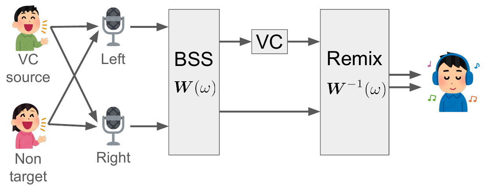

# Spatial Voice Conversion - Implemetation
This is an official implemetation of [**Spatial Voice Conversion: Voice Conversion Preserving Spatial Information and Non-target Signals**](https://arxiv.org/abs/2406.17722).

# What is Spatial VC?
Traditional voice conversion (VC) focuses on single-channel audio and ignores background noise signals. In contrast, **Spatial Voice Conversion (Spatial VC)** is a new voice conversion task that performs voice conversion on multi-channel signals while preserving spatial information and non-target signals. This task aims to provide a more immersive and realistic auditory experience in augmented reality and virtual reality.

This repository offers a baseline for Spatial VC using an approach that combines blind source separation, voice conversion, and spatial mixing, as illustrated below.



# Audio Samples
You can access the demo page from [here](https://sarulab-speech.github.io/demo_spatial_voice_conversion/).

# Usage
## Dependencies
You can install the required Python packages with the following command:
```
pip3 install -r requirements.txt
```

## Training
You need to train the Voice Conversion (VC) model. Move to the `VC/DDSP-SVC` directory and follow the instructions in the README to proceed with the training.

## Inference
You can try Spatial VC using the command `python3 experiment.py`. The results will be output under the `output/test` directory.

